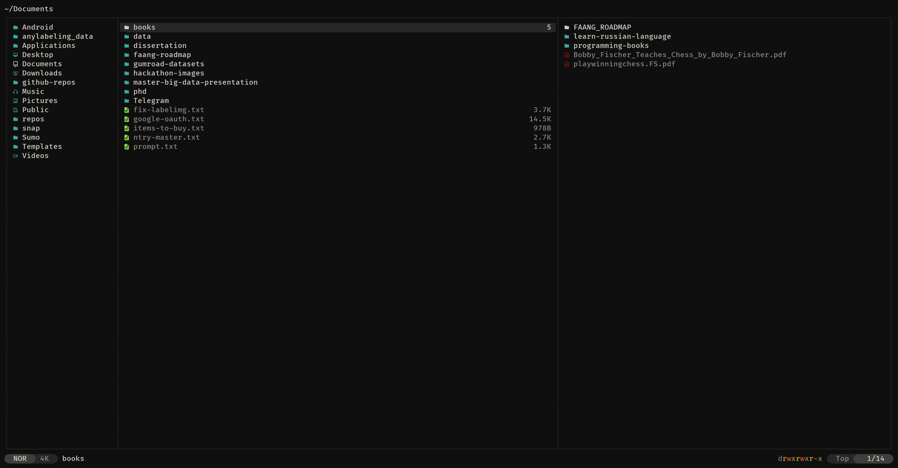

# yazi config

My [Yazi](https://github.com/sxyazi/yazi) config: vim-style keys, git status, Flexoki Dark theme.

By [@AhmadovMahammad](https://github.com/AhmadovMahammad)



## Install

Needs [Yazi](https://github.com/sxyazi/yazi) `>= 26` and a [Nerd Font](https://www.nerdfonts.com/).

```sh
git clone https://github.com/AhmadovMahammad/yazi-config.git ~/.config/yazi
ya pkg install
```

Run `yazi`. Update plugins with `ya pkg upgrade`.

## Plugins

`full-border`, `git`, `smart-enter`, `chmod`. Installed via `ya pkg`, tracked in `package.toml`.

## Key bindings

Vim-style. The essentials below; press `~` inside Yazi for the full list.

**Navigation**

| Key | Action |
| --- | --- |
| `h` / `l` | Parent dir / enter or open |
| `j` / `k` | Down / up |
| `gg` / `G` | Top / bottom |
| `H` / `L` | History back / forward |
| `Ctrl+u` / `Ctrl+d` | Half page up / down |
| `g h` / `g c` / `g d` | Go home / config / Downloads |

**Selecting & files**

| Key | Action |
| --- | --- |
| `Space` | Toggle selection |
| `v` | Visual (select) mode |
| `y` / `x` / `p` | Copy / cut / paste |
| `d` / `D` | Trash / delete permanently |
| `a` / `r` | Create / rename |
| `o` / `O` | Open / pick an app |
| `c m` | Chmod |
| `c c` / `c f` | Copy full path / filename |
| `;` / `:` | Shell / shell (blocking) |
| `.` | Toggle hidden files |

**Find & jump**

| Key | Action |
| --- | --- |
| `/` `n` `N` | Find, next, previous |
| `f` | Filter |
| `s` / `S` | Search name (fd) / content (rg) |
| `z` / `Z` | Jump via fzf / zoxide |

**Tabs**

| Key | Action |
| --- | --- |
| `t t` | New tab |
| `1` .. `9` | Switch to tab |
| `[` / `]` | Previous / next tab |
